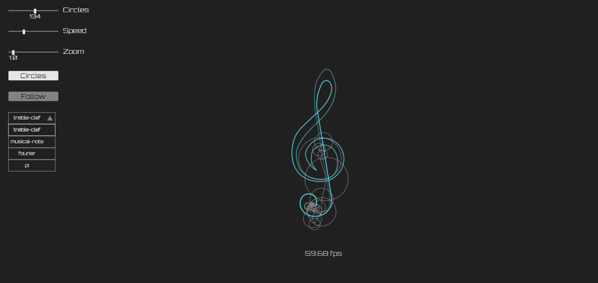

# js-fourier_visualization
This is a proyect on visualizing fourier series I built using <a href="https://p5js.org/">p5.js</a>.
## URL
This proyect is hosted by github pages at <a href="https://pabloqb2000.github.io/js-fourier_visualization/">this link</a>.
## Algorithm
The proyect works by calculating the starting conditions of n complex numbers. 
Those complex numbers do 0, 1, 2, ... full rotation every ten seconds (clockwise and counterclockwise). 
This numbers are added and the result of the adition is a point in the final path, as time goes on the path is fully drawn. 
The initial condition of the complex numbers is calcualated with and integral (wich is aproximated numerically). 
For more information on Fourier series visit <a href="https://www.youtube.com/watch?v=r6sGWTCMz2k">3b1b video</a>
## Screenshot
</img>
## References
To find more information about the <b>awesome</b> library used for this proyect visit:
<a href="https://p5js.org/"> https://p5js.org/ </a> 
For more information on Fourier series visit <a href="https://www.youtube.com/watch?v=r6sGWTCMz2k">3b1b video</a> 
Links to the author of the svg files: 
Pi: Icon made by <a href="https://www.flaticon.com/authors/freepik" title="Freepik">Freepik</a> from <a href="https://www.flaticon.com/" title="Flaticon">www.flaticon.com</a> 
Double quaver: Icon made by <a href="https://www.flaticon.com/authors/becris" title="Becris">Becris</a> from <a href="https://www.flaticon.com/" title="Flaticon">www.flaticon.com</a> 
## Other proyects
Checkout my other proyects at <a href="https://pabloqb2000.github.io/Click_math/">Click math</a>
